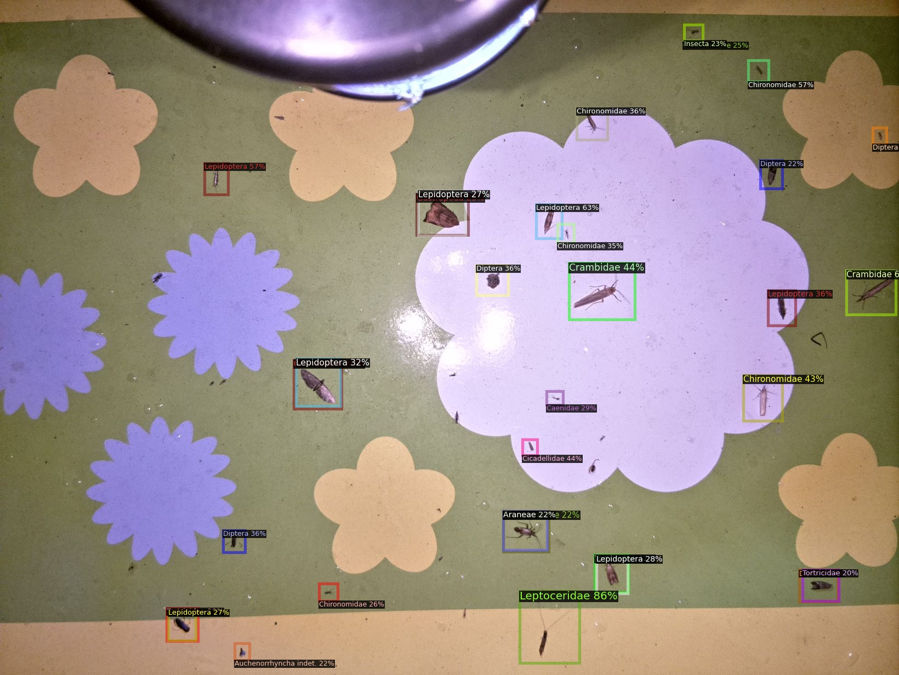

# Usage

## Overview
This notebook uses Detectron2's Faster R-CNN model with a ResNet-50 backbone and Feature Pyramid Network (FPN) to detect and classify insects in images. It guides you through setting up the environment, loading the model, processing images, and visualizing the results.

<a href="https://colab.research.google.com/drive/1QZoKi-58ZdS5S6GkkmfUZKo0L8OoiIkJ?usp=share_link" target="_blank">
  
</a>

### ⚠️ Disclaimer

**This page covers the basic process workflow. The provided notebook gives the additional option of running inference on either a single image or a folder of images and saves the results, both annotated images and .CSV file, by default.**

## Prerequisites
1. **Google Colab**: Ensure you are running this notebook in Google Colab for GPU support.
2. **Drive Access**: Mount your Google Drive to access and store files.

## Steps to Use

### 1. Mount Google Drive
Mount your Google Drive to access and save images.

```python
from google.colab import drive
drive.mount('/content/drive')
```

### 2. Install Detectron2
Install Detectron2 library and its dependencies.

```python
!python -m pip install pyyaml==5.1
import sys, os, distutils.core
!git clone 'https://github.com/facebookresearch/detectron2'
dist = distutils.core.run_setup("./detectron2/setup.py")
!python -m pip install --quiet {' '.join([f"'{x}'" for x in dist.install_requires])}
sys.path.insert(0, os.path.abspath('./detectron2'))
```

### 3. Add Necessary Imports
Import the required libraries and modules for the process.

```python
import torch, detectron2
# Setup detectron2 logger
from detectron2.utils.logger import setup_logger
setup_logger()

# import some common libraries
import numpy as np
import os, json, cv2, random
from google.colab.patches import cv2_imshow
import matplotlib.pyplot as plt

# import some common detectron2 utilities
from detectron2.config import get_cfg
from detectron2.engine import DefaultPredictor
from detectron2.data import MetadataCatalog
from detectron2.utils.visualizer import Visualizer, ColorMode
```

### 4. Configure the Model
Set up the configuration for the Detectron2 Faster R-CNN model.

```python
cfg = get_cfg()
cfg.merge_from_file('/content/drive/MyDrive/Fontys_Sem7/insect_detection/Detectron2 - Faster-RCNN/results5/config.yml')
cfg.MODEL.WEIGHTS = '/content/drive/MyDrive/Fontys_Sem7/insect_detection/Detectron2 - Faster-RCNN/results5/model_final.pth'
cfg.MODEL.ROI_HEADS.SCORE_THRESH_TEST = 0.2
predictor = DefaultPredictor(cfg)
```

### 5. Load an Image and run the predictor
Load the image you want to process from your Google Drive and use the model to detect and classify insects in the image.

```python
image_path = '/content/drive/MyDrive/Fontys_Sem7/insect_detection/Detectron2 - Faster-RCNN/flower-night.jpg'
im = cv2.imread(image_path)
outputs = predictor(im)
```


### 6. Instantiate the classes
Load the categories that have been used during the training to map the predictions to the correct names.

```python
thing_classes = {'thing_classes':['Acrididae',
                         'Agapeta',
                         'Agapeta hamana',
                         'Animalia',
                         'Anisopodidae',
                         'Aphididae',
                         'Apidae',
                         'Arachnida',
                         'Araneae',
                         'Arctiidae',
                         'Auchenorrhyncha indet.',
                         'Baetidae',
                         'Cabera',
                         'Caenidae',
                         'Carabidae',
                         'Cecidomyiidae',
                         'Ceratopogonidae',
                         'Cercopidae',
                         'Chironomidae',
                         'Chrysomelidae',
                         'Chrysopidae',
                         'Chrysoteuchia culmella',
                         'Cicadellidae',
                         'Coccinellidae',
                         'Coleophoridae',
                         'Coleoptera',
                         'Collembola',
                         'Corixidae',
                         'Crambidae',
                         'Culicidae',
                         'Curculionidae',
                         'Dermaptera',
                         'Diptera',
                         'Eilema',
                         'Empididae',
                         'Ephemeroptera',
                         'Erebidae',
                         'Fanniidae',
                         'Formicidae',
                         'Gastropoda',
                         'Gelechiidae',
                         'Geometridae',
                         'Hemiptera',
                         'Hydroptilidae',
                         'Hymenoptera',
                         'Ichneumonidae',
                         'Idaea',
                         'Insecta',
                         'Lepidoptera',
                         'Leptoceridae',
                         'Limoniidae',
                         'Lomaspilis marginata',
                         'Miridae',
                         'Mycetophilidae',
                         'Nepticulidae',
                         'Neuroptera',
                         'Noctuidae',
                         'Notodontidae',
                         'Object',
                         'Opiliones',
                         'Orthoptera',
                         'Panorpa germanica',
                         'Panorpa vulgaris',
                         'Parasitica indet.',
                         'Plutellidae',
                         'Psocodea',
                         'Psychodidae',
                         'Pterophoridae',
                         'Pyralidae',
                         'Pyrausta',
                         'Sepsidae',
                         'Spilosoma',
                         'Staphylinidae',
                         'Stratiomyidae',
                         'Syrphidae',
                         'Tettigoniidae',
                         'Tipulidae',
                         'Tomoceridae',
                         'Tortricidae',
                         'Trichoptera',
                         'Triodia sylvina',
                         'Yponomeuta',
                         'Yponomeutidae']}
```

### 6. Visualize the predictions
Use the model to detect and classify insects in the image.

```python
v = Visualizer(im[:, :, ::-1], thing_classes)
out = v.draw_instance_predictions(outputs["instances"].to("cpu"))
cv2_imshow(out.get_image()[:, :, ::-1])
```



### 7. Save the Processed Image
Save the processed image back to your Google Drive.

```python
save_path = '/content/drive/MyDrive/Fontys_Sem7/insect_detection/Detectron2 - Faster-RCNN/flower-night_detections.jpg'
cv2.imwrite(save_path, out.get_image()[:, :, ::-1])
```

## Conclusion
By following these steps, you can use the notebook to process images, detect and classify insects using Detectron2's Faster R-CNN model, and visualize the results. Adjust the file paths and parameters as needed to fit your specific use case.