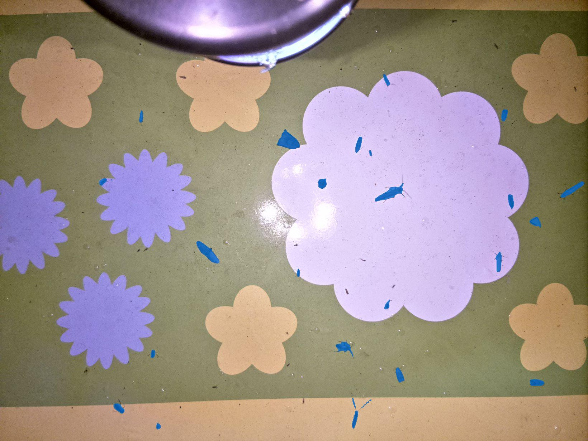
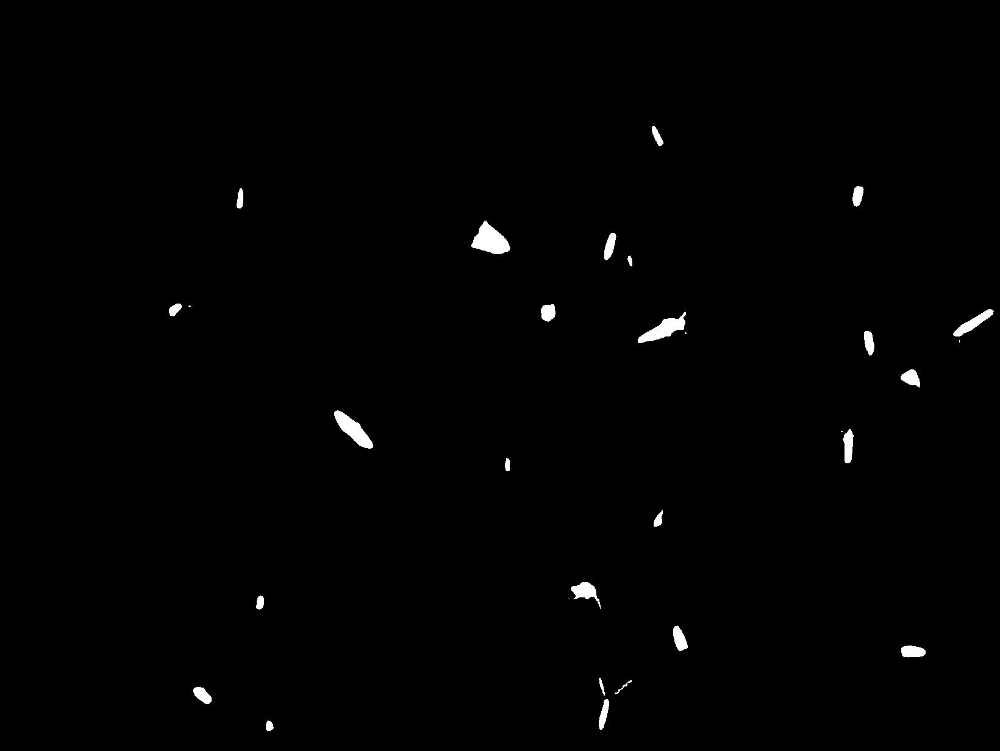
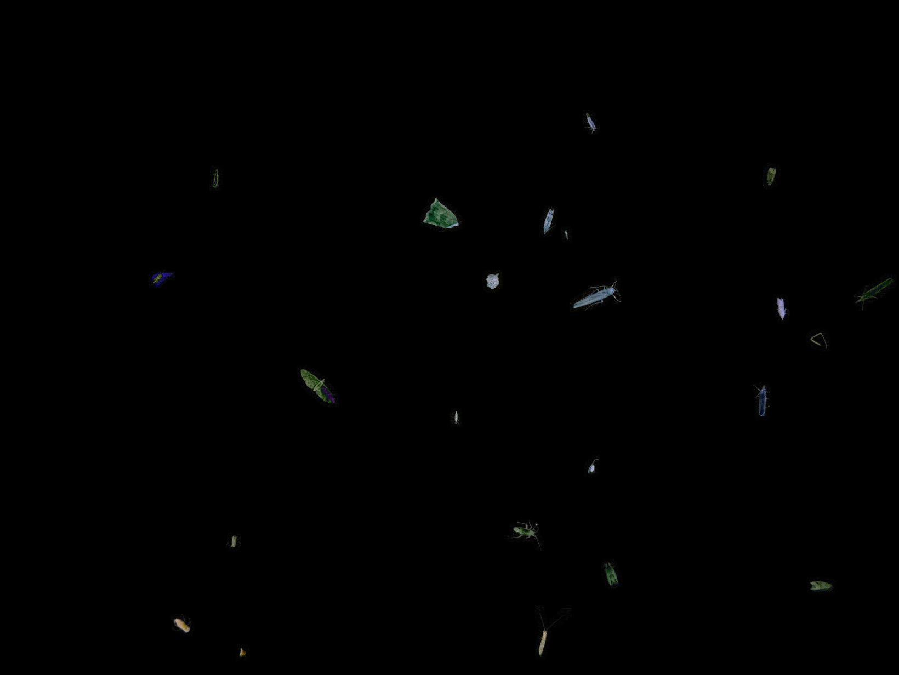

# Process steps explanation

Let's take a look at the output at each step of the process in order to better understant the whole process:

## 1. Load captured image
First we need to load the image that we want to process.

## 2. Detect the insects:
Then we need to detect all the insects using Grounding DINO.

## 3. Segment the insects:
We need to mask the detected insects to be able to show a more precise location for each one of them.

## 4. Dilate the mask:
In order to make sure we are covering the whole insect we need to take the black and white mask and dilate it a little.

## 5. Inpaint the insects:
Using the dilated mask, we know exactly what parts need to be inpainted and thus removed from the image in a context-aware manner.

## 6. Background subtraction:
By getting the difference between the original and inpainted images we can see precise outlines of the insects.

## 7. Mask thresholding:
We apply a threshold to the mask in order to transform the subtraction difference into a binary (black and white) mask that outlines well the insects.

## 8. Overlay masked original on yellow background:
Once we have the final mask, we need to apply it to the original image in order to get only the detected insects and replace the rest with a yellow background.

## 9. Pass image through DIOPSIS algorithm.
Finally, we can pass the yellow background image through the original algorithm.
