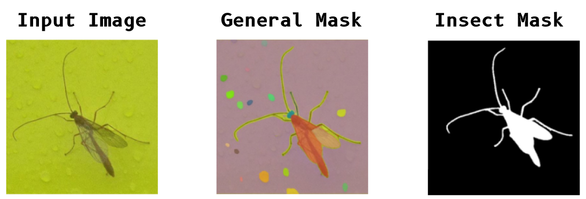
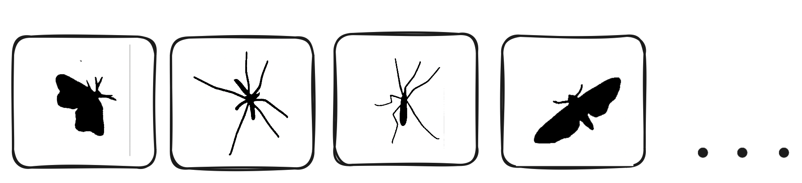
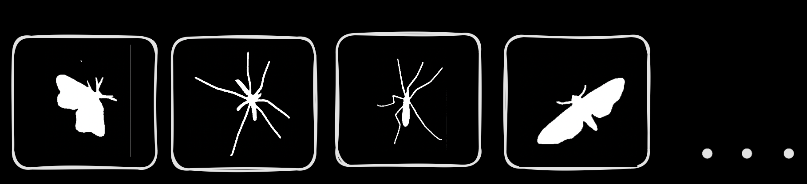
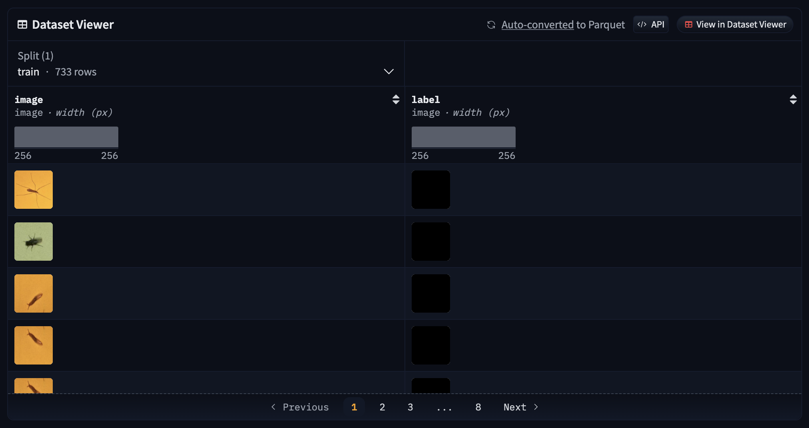
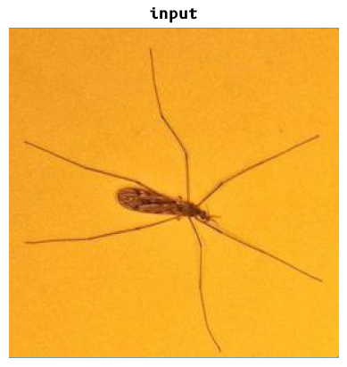
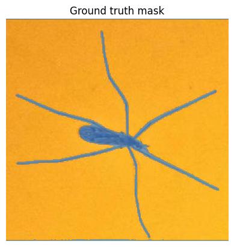

# Training and Improving InsectSAM

# Methods

How was InsectSAM trained? Can we improve InsectSAM? 

The training involved preparing the dataset, generating semantic masks using `SamAutomaticMaskGenerator`, and fine-tuning the **Segment Anything Model (SAM)** to detect and segment insects in images. This page will guide you through the process of training and improving InsectSAM, helpful for future research and development.



#### A detailed and visual project workflow can be found here:


## Data Cleaning and Augmentation for InsectSAM

Before training InsectSAM, it is essential to clean and prepare the dataset to ensure high-quality data is used for training. This section covers the steps involved in data cleaning, inverting masks, and augmenting the dataset.

### Data Cleaning

#### Move Small Images

The first step is to clean the dataset by removing all `.jpg` files smaller than 1KB. These small files are often unusable and could negatively impact the training process.

```python
import os
import shutil

# Specify the directory to search for .jpg files
source_directory = '/diopsis_public_classification_clean/images/'
destination_directory = os.path.join(source_directory, 'unusable_data')

# Create the destination directory if it doesn't exist
if not os.path.exists(destination_directory):
    os.makedirs(destination_directory)

# Function to move .jpg files smaller than 1KB
def move_small_images(source, destination):
    # List all files in the source directory
    for file_name in os.listdir(source):
        # Check if the file is a .jpg image
        if file_name.endswith('.jpg'):
            file_path = os.path.join(source, file_name)
            
            # Check if the file size is smaller than 1KB
            if os.path.getsize(file_path) < 1024:  # 1KB = 1024 bytes
                # Move the file to the destination directory
                shutil.move(file_path, os.path.join(destination, file_name))
                print(f'Moved: {file_name}')

# Run the function to move the small .jpg files
move_small_images(source_directory, destination_directory)
```

### Dataset Augmentation

To improve the robustness of the model, we augment the dataset by applying random rotations and flips to the images and their corresponding masks. This process increases the diversity of the training data, helping the model generalize better.

#### Augment with Rotations and Flips

We augment the dataset by resizing images, applying random rotations, and flipping them. The script ensures that each image and its corresponding mask are augmented in sync.

```python
import os
from PIL import Image
import numpy as np
import random

images_path = '/diopsis_public_classification_clean/rb-ibdm-dataset/finetune-dataset/image'
masks_path = '/diopsis_public_classification_clean/rb-ibdm-dataset/finetune-dataset/label'
aug_images_path = '/diopsis_public_classification_clean/rb-ibdm-dataset/finetune-dataset/image-aug'
aug_masks_path = '/diopsis_public_classification_clean/rb-ibdm-dataset/finetune-dataset/label-aug'

# Ensure the output directories exist
os.makedirs(aug_images_path, exist_ok=True)
os.makedirs(aug_masks_path, exist_ok=True)

# Load images and masks filenames, ignoring .DS_Store on MacOS
images_filenames = [f for f in sorted(os.listdir(images_path)) if f != '.DS_Store']
masks_filenames = [f for f in sorted(os.listdir(masks_path)) if f != '.DS_Store']

# Function to augment an image and a mask
def augment_image_and_mask(image_path, mask_path, output_image_path, output_mask_path, angle, size):
    image = Image.open(image_path)
    mask = Image.open(mask_path)
    
    image = image.resize(size, Image.Resampling.LANCZOS)
    mask = mask.resize(size, Image.Resampling.LANCZOS)
    
    image = image.rotate(angle, expand=True)
    mask = mask.rotate(angle, expand=True)
    
    image.save(output_image_path)
    mask.save(output_mask_path)

# Augmentation settings
desired_count = 1002
angles = [90, 180, 270] 
size = (256, 256)

# Start augmentation counter from 267
start_counter = 267
current_count = len(images_filenames)
augmentation_factor = (desired_count - start_counter + 1) // current_count
remaining_images = (desired_count - start_counter + 1) - augmentation_factor * current_count

# Start augmentation
counter = start_counter
for i, (image_filename, mask_filename) in enumerate(zip(images_filenames, masks_filenames)):
    image_path = os.path.join(images_path, image_filename)
    mask_path = os.path.join(masks_path, mask_filename)
    
    times_to_augment = augmentation_factor + (1 if i < remaining_images else 0)
    
    for j in range(times_to_augment):
        angle = random.choice(angles)
        output_image_path = os.path.join(aug_images_path, f"{counter}.jpg")
        output_mask_path = os.path.join(aug_masks_path, f"{counter}.png")
        augment_image_and_mask(image_path, mask_path, output_image_path, output_mask_path, angle, size)
        counter += 1

print("Augmentation completed. Check the augmented images and masks directories.")
```

By following these steps, we ensure that the dataset used for training InsectSAM is clean, high-quality, and sufficiently diverse. This data preparation process is crucial for training a robust and accurate segmentation model.

## Generating Masks with SAM

[RB-IBDM Image Segmentation Notebook on GitHub](https://github.com/martintmv-git/RB-IBDM/blob/main/Experiments/Segment%20Anything/Annotated%20dataset%20masks/sam_full_dataset_generate_masks.ipynb)

### Installing Dependencies

First, we need to install the SAM and its dependencies. This is necessary to ensure that the required libraries and tools are available for generating masks and training the model.

```bash
!pip install -q 'git+https://github.com/facebookresearch/segment-anything.git'
```

### Downloading SAM Weights

Next, download the SAM weights necessary for the model. These weights are pre-trained on a huge dataset and provide a good starting point for fine-tuning for any segmentation tasks.

```bash
!mkdir -p $HOME/weights
!wget -q https://dl.fbaipublicfiles.com/segment_anything/sam_vit_h_4b8939.pth -P $HOME/weights
```

### Setting Up the Environment

We set the path for the SAM checkpoint and verify its existence. This ensures that the weights are correctly downloaded and accessible.

```python
import os

CHECKPOINT_PATH = os.path.join(os.environ["HOME"], "weights", "sam_vit_h_4b8939.pth")
print(CHECKPOINT_PATH, "; exist:", os.path.isfile(CHECKPOINT_PATH))
```

### Downloading Insect Data

We mount Google Drive to access the dataset and define the paths for the dataset and where the generated masks will be saved. This step is crucial for accessing the images and saving the generated masks for training.

```python
import os
from google.colab import drive

drive.mount('/content/drive')

# Dataset of images
dataset_path = '/content/drive/MyDrive/images_clean_test'

# Where the generated masks will be saved
save_path = '/content/drive/MyDrive/diopsis_masks_test'

# Ensure the directory exists
if not os.path.exists(save_path):
    os.makedirs(save_path)
    print(f"Directory created for saving masks: {save_path}")
else:
    print(f"Save directory already exists: {save_path}")

# Counting the number of images in the dataset
num_images = len(os.listdir(dataset_path))
print(f"Number of images read in dataset: {num_images}")
```


## Automated Mask Generation

### Loading the Model

We load the SAM model with the specified checkpoint and set the device to GPU if available. This prepares the model for generating segmentation masks.

```python
import torch
from segment_anything import sam_model_registry, SamAutomaticMaskGenerator

DEVICE = torch.device('cuda:0' if torch.cuda.is_available() else 'cpu')
MODEL_TYPE = "vit_h"

sam = sam_model_registry[MODEL_TYPE](checkpoint=CHECKPOINT_PATH).to(device=DEVICE)
```

### Generating Masks with SamAutomaticMaskGenerator

We instantiate the `SamAutomaticMaskGenerator` with the loaded SAM model. This class provides a convenient way to generate masks automatically.

```python
mask_generator = SamAutomaticMaskGenerator(sam)
```

### Processing Images and Saving Masks

We define functions to process images in batches and save the generated masks to the drive. This step is necessary to efficiently handle large datasets and store the generated masks for later use.

```python
import cv2
from PIL import Image
import numpy as np

def save_masks_to_drive(masks, save_path, image_name):
    if masks:  # Check if there is at least one mask
        try:
            img = Image.fromarray((masks[0] * 255).astype(np.uint8))  # Use only the first mask
            mask_file_path = os.path.join(save_path, f'mask_{image_name}_0.png')  # Name for the first mask
            img.save(mask_file_path)
            print(f"Successfully saved mask to drive: {mask_file_path}")
        except Exception as e:
            print(f"Failed saving mask to drive for {image_name}: {e}")

def process_images_in_batches(dataset_path, save_path, batch_size=100):
    image_paths = [os.path.join(dataset_path, f) for f in os.listdir(dataset_path) if os.path.isfile(os.path.join(dataset_path, f))]
    for i in range(0, len(image_paths), batch_size):
        batch_paths = image_paths[i:i+batch_size]
        for path in batch_paths:
            try:
                print(f"Processing: {path}")
                image_bgr = cv2.imread(path)
                image_rgb = cv2.cvtColor(image_bgr, cv2.COLOR_BGR2RGB)
                sam_result = mask_generator.generate(image_rgb)
                masks = [mask['segmentation'] for mask in sorted(sam_result, key=lambda x: x['area'], reverse=True)]

                # Saving only the first mask as it's the most valuable for later training
                save_masks_to_drive(masks, save_path, os.path.basename(path).replace('.jpg', '').replace('.png', ''))
                print(f"Successfully processed and saved masks for: {path}")
            except Exception as e:
                print(f"Error processing {path}: {e}")

# Process the images in batches
process_images_in_batches(dataset_path, save_path, batch_size=100)
```
The masks generated by the `SamAutomaticMaskGenerator` are saved to the specified directory and look like the following:


### Invert Masks

In some datasets, masks might need to be inverted to match the expected input format for the model. The following script inverts the mask images, converting black pixels to white and vice versa. This step ensured that the `white` pixels represent the insect regions in the images, and the `black` pixels represent the background.

```python
import os
import numpy as np
from PIL import Image
import matplotlib.pyplot as plt

def invert_image(image_path, show_images=False):
    # Load the image and convert to grayscale
    img = Image.open(image_path).convert('L')

    # Convert image to numpy array
    img_np = np.array(img)

    # Invert the image
    inverted_img_np = 255 - img_np

    # Convert back to an image
    inverted_img = Image.fromarray(inverted_img_np)

    if show_images:
        fig, ax = plt.subplots(1, 2, figsize=(12, 6))
        ax[0].imshow(img_np, cmap='gray')
        ax[0].set_title('Original Image')
        ax[0].axis('off')

        ax[1].imshow(inverted_img_np, cmap='gray')
        ax[1].set_title('Inverted Image')
        ax[1].axis('off')

        plt.show()

    # Save the inverted image
    inverted_img.save(image_path)

def process_folder(folder_path):
    # List all PNG files in the folder
    for filename in os.listdir(folder_path):
        if filename.endswith('.png'):
            image_path = os.path.join(folder_path, filename)
            invert_image(image_path, show_images=False)
            print(f'Processed {filename}')

folder_path = '/Users/martintomov/Desktop/dataset/labelcopy'
process_folder(folder_path)
```



## Deploying the Dataset to Hugging Face 🤗

After generating the masks, the dataset is prepared and deployed to Hugging Face. This step involves encoding the images and labels and pushing the dataset to the Hugging Face Hub for easy access and use in training. The dataset gets converted to **parquet** format.

```python
from datasets import Dataset, DatasetDict, Features, Image
import os
from PIL import Image as PILImage
import io

data_dir = "/dataset"

# Helper function to encode image files as RGB
def encode_image(image_path):
    with open(image_path, 'rb') as image_file:
        image = PILImage.open(image_file)
        image = image.convert("RGB") 
        byte_io = io.BytesIO()
        image.save(byte_io, 'PNG')
        return byte_io.getvalue()

# Helper function to encode label files without changing their color mode
def encode_label(label_path):
    with open(label_path, 'rb') as label_file:
        label = PILImage.open(label_file)
        byte_io = io.BytesIO()
        label.save(byte_io, 'PNG')
        return byte_io.getvalue()

image_files = sorted([os.path.join(data_dir, 'image', file) for file in os.listdir(os.path.join(data_dir, 'image')) if file.endswith('.png')])
label_files = sorted([os.path.join(data_dir, 'label', file) for file in os.listdir(os.path.join(data_dir, 'label')) if file.endswith('.png')])

assert len(image_files) == len(label_files), "The number of images and labels should be the same"

data = []
for image_path, label_path in zip(image_files, label_files):
    data.append({
        'image': encode_image(image_path),
        'label': encode_label(label_path)
    })

features = Features({'image': Image(), 'label': Image()})

# Create a Dataset object
dataset = Dataset.from_dict({'image': [item['image'] for item in data], 'label': [item['label'] for item in data]}, features=features)

# Convert to a DatasetDict
dataset = DatasetDict({'train': dataset})

# Authenticate with Hugging Face and push the dataset
dataset.push_to_hub("martintmv/rb-ibdm")
```
#### The dataset can be accessed here: https://huggingface.co/datasets/martintmv/rb-ibdm-l

> .TIFF masks seem to be completely dark, however that's not the case. This is a known issue with the Hugging Face dataset viewer.



## Training InsectSAM

<a href="https://colab.research.google.com/github/martintmv-git/RB-IBDM/blob/main/InsectSAM/InsectSAM.ipynb\" target="_parent">
  
</a>

[Training InsectSAM on GitHub](https://github.com/martintmv-git/RB-IBDM/blob/main/InsectSAM/InsectSAM.ipynb)

### Installing Dependencies

We install necessary libraries including `transformers`, `datasets`, and `monai`. These libraries provide the tools needed for training and evaluating the model.

```bash
!pip install -q git+https://github.com/huggingface/transformers.git
!pip install -q datasets
!pip install -q monai
```

### Loading the Dataset

We load the dataset from Hugging Face. The dataset contains images and their corresponding masks, which will be used for training the model.

```python
from datasets import load_dataset

dataset = load_dataset("martintmv/rb-ibdm", split="train")

print(dataset)
```

### Visualizing an Example

We visualize an example image and its corresponding mask to understand the data format. This helps in verifying that the dataset has been loaded correctly and is in the expected format.

```python
example = dataset[0]
image = example['image']
label = example["label"]

# Print the format of the image and label
print("Image format:", image.format)
print("Label format:", label.format)

import matplotlib.pyplot as plt
import numpy as np

def show_mask(mask, ax, random_color=False):
    if random_color:
        color = np.concatenate([np.random.random(3), np.array([0.6])], axis=0)
    else:
        color = np.array([30/255, 144/255, 255/255, 0.6])
    h, w = mask.shape[-2:]
    mask_image = mask.reshape(h, w, 1) * color.reshape(1, 1, -1)
    ax.imshow(mask_image)

fig, axes = plt.subplots()
axes.imshow(np.array(image))
ground_truth_seg = np.array(label)
show_mask(ground_truth_seg, axes)
axes.title.set

_text("Ground truth mask")
axes.axis("off")
```





### Creating PyTorch Dataset

We define a PyTorch dataset to prepare the data in the format required by the model. Each example includes pixel values, a bounding box prompt, and a ground truth segmentation mask. The bounding box prompt is derived from the ground truth mask and helps the model focus on the relevant region.

```python
from torch.utils.data import Dataset
from transformers import SamProcessor

def get_bounding_box(ground_truth_map):
    y_indices, x_indices = np.where(ground_truth_map > 0)
    x_min, x_max = np.min(x_indices), np.max(x_indices)
    y_min, y_max = np.min(y_indices), np.max(y_indices)
    H, W = ground_truth_map.shape
    x_min = max(0, x_min - np.random.randint(0, 20))
    x_max = min(W, x_max + np.random.randint(0, 20))
    y_min = max(0, y_min - np.random.randint(0, 20))
    y_max = min(H, y_max + np.random.randint(0, 20))
    bbox = [x_min, y_min, x_max, y_max]
    return bbox

class SAMDataset(Dataset):
    def __init__(self, dataset, processor):
        self.dataset = dataset
        self.processor = processor

    def __len__(self):
        return len(self.dataset)

    def __getitem__(self, idx):
        item = self.dataset[idx]
        image = item["image"]
        ground_truth_mask = np.array(item["label"])

        # Get bounding box prompt
        prompt = get_bounding_box(ground_truth_mask)

        # Prepare image and prompt for the model
        inputs = self.processor(image, input_boxes=[[prompt]], return_tensors="pt")

        # Remove batch dimension which the processor adds by default
        inputs = {k:v.squeeze(0) for k,v in inputs.items()}

        # Add ground truth segmentation
        inputs["ground_truth_mask"] = ground_truth_mask

        return inputs

processor = SamProcessor.from_pretrained("facebook/sam-vit-base")
train_dataset = SAMDataset(dataset=dataset, processor=processor)

example = train_dataset[0]
for k,v in example.items():
    print(k, v.shape)
```

### Creating PyTorch DataLoader

We create a DataLoader to get batches from the dataset. This allows us to efficiently feed data to the model during training.

```python
from torch.utils.data import DataLoader

train_dataloader = DataLoader(train_dataset, batch_size=2, shuffle=True)

batch = next(iter(train_dataloader))
for k,v in batch.items():
    print(k, v.shape)
```

### Loading the Model

We load the SAM model and ensure that only the mask decoder parameters are trainable. This is important to prevent other parts of the model from being updated during fine-tuning.

```python
from transformers import SamModel

model = SamModel.from_pretrained("facebook/sam-vit-base")

# Ensure only mask decoder parameters are trainable
for name, param in model.named_parameters():
    if name.startswith("vision_encoder") or name.startswith("prompt_encoder"):
        param.requires_grad_(False)
```

### Training the Model

We define the optimizer and loss function, then train the model. The model is trained for a specified number of epochs, and the loss is computed and minimized in each iteration.

```python
from torch.optim import Adam
import monai

# Hyperparameters
optimizer = Adam(model.mask_decoder.parameters(), lr=1e-5, weight_decay=0)
seg_loss = monai.losses.DiceCELoss(sigmoid=True, squared_pred=True, reduction='mean')

from tqdm import tqdm
from statistics import mean
import torch

num_epochs = 100
device = "cuda" if torch.cuda.is_available() else "cpu"
model.to(device)

model.train()
for epoch in range(num_epochs):
    epoch_losses = []
    for batch in tqdm(train_dataloader):
        # Forward pass
        outputs = model(pixel_values=batch["pixel_values"].to(device),
                        input_boxes=batch["input_boxes"].to(device),
                        multimask_output=False)

        # Compute loss
        predicted_masks = outputs.pred_masks.squeeze(1)
        ground_truth_masks = batch["ground_truth_mask"].float().to(device)
        loss = seg_loss(predicted_masks, ground_truth_masks.unsqueeze(1))

        # Backward pass
        optimizer.zero_grad()
        loss.backward()

        # Optimize
        optimizer.step()
        epoch_losses.append(loss.item())

    print(f'EPOCH: {epoch}')
    print(f'Mean loss: {mean(epoch_losses)}')
```

### Saving the Model

After training, we save the trained model to Google Drive. This ensures that the model can be reused or further fine-tuned later.

```python
drive.mount('/content/drive')

# Save the model
model_save_path = '/content/drive/MyDrive/diopsis_tests/'
os.makedirs(model_save_path, exist_ok=True)
model.save_pretrained(model_save_path)
print(f'Model saved to {model_save_path}')
```
After training, the model is saved to Google Drive for future use, but it should also auto-save to HuggingFace. The model can be loaded and used for inference on new images to detect and segment insects. 


## Conclusion

This page provides a comprehensive guide to training and improving InsectSAM using any insect dataset. The process includes dataset preparation, automated mask generation, dataset deployment to Hugging Face, model training, and inference. The trained model can detect and segment insects in images, demonstrating the effectiveness of the fine-tuning process. 

The objective of this guide is to demonstrate the modular construction of InsectSAM, highlighting how it can be incrementally improved through enhanced training and superior dataset quality. By following the notebooks in our repository, you can ensure the model remains future-proof, easily adjustable, and re-trainable. Leveraging a more diverse and high-quality dataset will enable the generation of superior masks, thereby further refining InsectSAM's performance.

## Links
Links to the notebooks used in this guide (containing all code needed):

- Data cleaning and augmentation - [here](https://github.com/martintmv-git/RB-IBDM/tree/main/EDA/InsectSAM%20Fine-tune%20Preparation).
- Generating masks with SAM - [here](https://github.com/martintmv-git/RB-IBDM/blob/main/Experiments/Segment%20Anything/Annotated%20dataset%20masks/sam_full_dataset_generate_masks.ipynb).
- Training InsectSAM - [here](https://github.com/martintmv-git/RB-IBDM/blob/main/InsectSAM/InsectSAM.ipynb).
- Inference with InsectSAM - [here](https://github.com/martintmv-git/RB-IBDM/blob/main/InsectSAM/Run_InsectSAM_Inference_Transformers.ipynb).
- InsectSAM with GroundingDINO - [here](https://github.com/martintmv-git/RB-IBDM/blob/main/InsectSAM/HF_Demo_InsectSAM_GroundingDINO.ipynb).