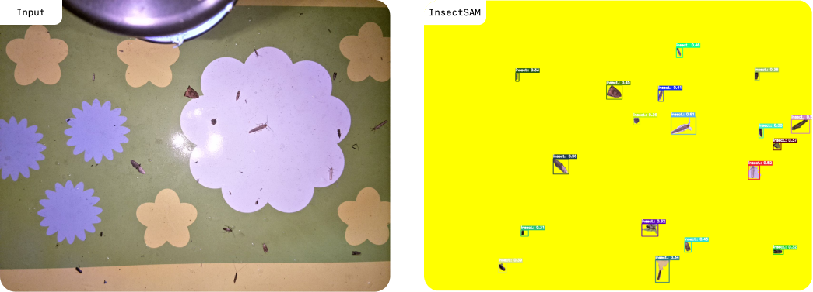

# Introduction

Welcome to the **RB-IBDM** documentation!

**RB-IBDM** is an open-source ML project designed for semantic segmentation of insect images. Leveraging advanced deep learning techniques, our models are capable of accurately identifying and segmenting various insect species in images, making it an invaluable tool for researchers, entomologists, and AI enthusiasts working in the field of insect identification and classification.

## Getting Started

Let's get you started with **RB-IBDM** and guide you through the initial steps to utilize this model effectively.

### What you'll need

- A modern development environment set up with the following:
  - [Python 3.11 or above](https://www.python.org/downloads/)
  - A compatible GPU setup (optional but recommended for faster processing)
  - Write here...