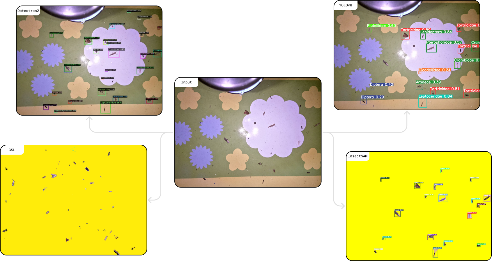
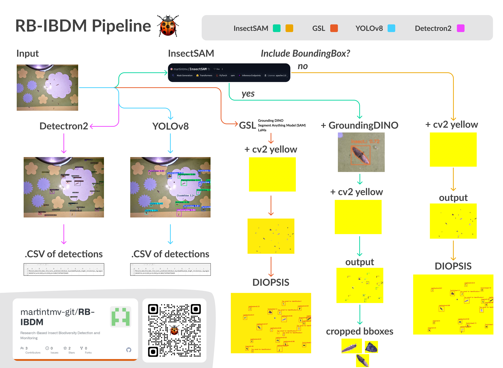

# Introduction

Welcome to the **RB-IBDM** documentation!

**RB-IBDM** is an open-source ML project designed for semantic segmentation and detection of insects. Leveraging advanced deep learning techniques, our models are capable of accurately identifying and segmenting various insect species in images, making it an invaluable tool for researchers, entomologists, and AI enthusiasts working in the field of insect identification and classification.

## Project Pipeline

## Getting Started

Let's get you started with **RB-IBDM** and guide you through the initial steps to utilize this model effectively.

Visit the project's GitHub repository → https://github.com/martintmv-git/RB-IBDM

### What you'll need (essentials)

- A modern development environment set up with the following:
  - A compatible GPU setup (NVIDIA GPU with CUDA support)
  - [Python 3.10 or above](https://www.python.org/downloads/)
