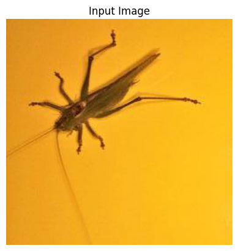
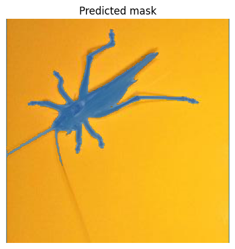

# Usage

## Installation

To begin using InsectSAM, you'll need to install the necessary dependencies and download the model from Hugging Face. Follow these steps:

1. Install the Hugging Face Transformers library:

   ```bash
   pip install transformers
   ```
2. Download and set up the InsectSAM model:

   ```python
   from transformers import AutoModelForImageSegmentation, AutoProcessor

   model = AutoModelForImageSegmentation.from_pretrained("martintmv/InsectSAM")
   processor = AutoProcessor.from_pretrained("martintmv/InsectSAM")
   ```

> Tip: Use this Jupyter Notebook - [Run InsectSAM using Transformers 🤗](https://github.com/martintmv-git/RB-IBDM/blob/main/InsectSAM/Run_InsectSAM_Inference_Transformers.ipynb)

Once you have the model set up, you can start using it to perform semantic segmentation on insect images. Here's a quick example to get you started:

1. **Install necessary packages:**
   ```bash
   !pip install -q git+https://github.com/huggingface/transformers.git
   !pip install datasets
   ```

2. **Load the model and processor:**
   ```python
   import torch
   from transformers import SamModel, SamProcessor

   device = "cuda" if torch.cuda.is_available() else "cpu"

   processor = SamProcessor.from_pretrained("martintmv/InsectSAM")
   model = SamModel.from_pretrained("martintmv/InsectSAM").to(device)
   ```

3. **Load an image:**
   ```python
   from PIL import Image
   import requests

   url = "URL_TO_YOUR_IMAGE"
   image = Image.open(requests.get(url, stream=True).raw)

   # Display the image
   import matplotlib.pyplot as plt

   plt.imshow(image)
   plt.title("Input Image")
   plt.axis("off")
   plt.show()
   ```

4. **Generate a bounding box for the image:**
   ```python
   def get_bounding_box(image):
       # Simulate a bounding box in the center of the image
       width, height = image.size
       x_min, x_max = width // 4, 3 * width // 4
       y_min, y_max = height // 4, 3 * height // 4
       return [[[float(x_min), float(y_min), float(x_max), float(y_max)]]]

   input_boxes = get_bounding_box(image)
   ```

5. **Prepare inputs for the model:**
   ```python
   inputs = processor(image, input_boxes=input_boxes, return_tensors="pt").to(device)
   for k, v in inputs.items():
       print(k, v.shape)
   ```

6. **Perform segmentation:**
   ```python
   with torch.no_grad():
       outputs = model(**inputs, multimask_output=False)
   ```

7. **Post-process and visualize the results:**
   ```python
   # Apply sigmoid
   insectsam_seg_prob = torch.sigmoid(outputs.pred_masks.squeeze(1))
   # Convert soft mask to hard mask
   insectsam_seg_prob = insectsam_seg_prob.cpu().numpy().squeeze()
   insectsam_seg = (insectsam_seg_prob > 0.5).astype(np.uint8)

   def show_mask(mask, ax, random_color=False):
       if random_color:
           color = np.concatenate([np.random.random(3), np.array([0.6])], axis=0)
       else:
           color = np.array([30/255, 144/255, 255/255, 0.6])
       h, w = mask.shape[-2:]
       mask_image = mask.reshape(h, w, 1) * color.reshape(1, 1, -1)
       ax.imshow(mask_image)

   fig, axes = plt.subplots()
   axes.imshow(np.array(image))
   show_mask(insectsam_seg, axes)
   axes.title.set_text("Predicted Mask")
   axes.axis("off")
   plt.show()
   ```


## Example Inferences

Here's an example of how the model segments an image:
|  |  |
|:--------------------------------------------------:|:--------------------------------------------------:|

## Further Reading

To dive deeper into the capabilities and advanced usage of InsectSAM, refer to the following resources:

- [InsectSAM Model Page on Hugging Face](https://huggingface.co/martintmv/InsectSAM)
- [InsectSAM Demo App on Hugging Face](https://huggingface.co/spaces/martintmv/InsectSAM)
- [Transformers Documentation](https://huggingface.co/transformers/)
- [PyTorch Documentation](https://pytorch.org/docs/stable/index.html)